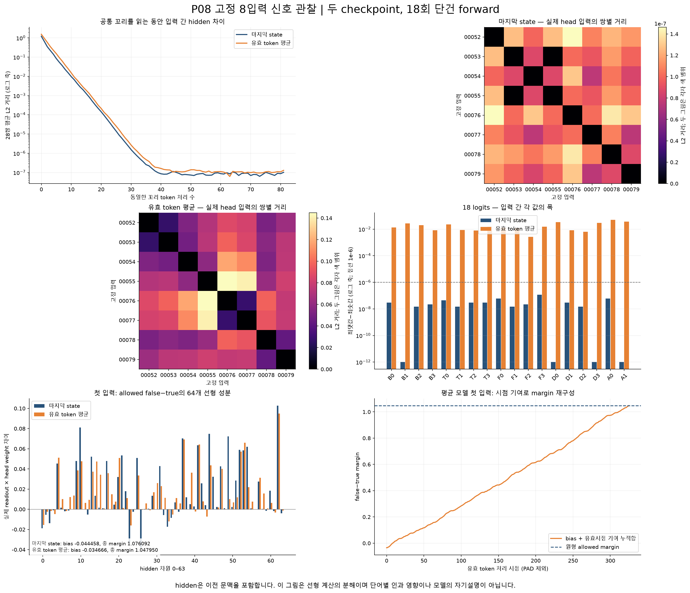

# Bounded development observations

Research failure/diagnosis, not production-ready. One seed only.

| Internal development metric | Last state | Valid mean |
|---|---:|---:|
| box accuracy |16%|16%|
| tool accuracy |20%|20%|
| from accuracy |30%|30%|
| to accuracy |45%|45%|
| allowed accuracy |79.5%|79.5%|
| joint all-five accuracy |0%|0%|
| mean five-head cross entropy |1.198354|1.198501|

Every TRAIN/development example ended with [0,3,0,3,0]. Always-false accuracy was79.5%.
Allowed balanced accuracy was50%; each relation balanced accuracy was25%.

Passive observation: final checkpoints, eight inputs and one repeat of the first per
checkpoint,18 single-item no-grad calls, no new training/backward/optimizer operations.
Repeat differences were zero.

| Maximum input spread | Last state | Valid mean |
|---|---:|---:|
| Actual readout component |5.96e-8|0.044893|
| Logit component |1.19e-7|0.049428|
| Probability component |5.96e-8|0.016579|

Both had the same argmax [0,3,0,3,0] on all eight inputs.
Last-state readout difference fell below the1e-6 numerical floor.
Mean readout/logits retained differences; only argmax stayed equal.
This does not support a claim that the mean head ignored readout differences.

Allowed false-minus-true margin was1.076092 for last and0.993624--1.079410 for mean.
Bias+64hidden-component reconstruction error was at most1.09e-7; valid-timestep
reconstruction error was at most1.02e-7.

Hidden includes previous context. Arithmetic is not word causality, a learned reason,
or self-explanation. Separately trained checkpoints are not a pure readout ablation.
Fixed-input distance does not prove semantic encoding or generalization.

